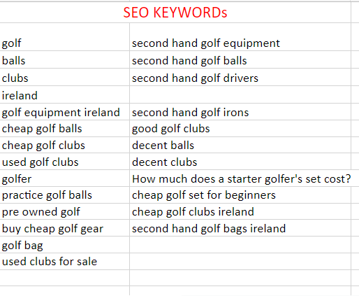
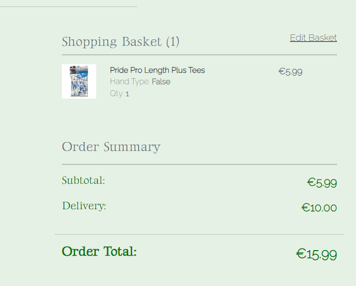
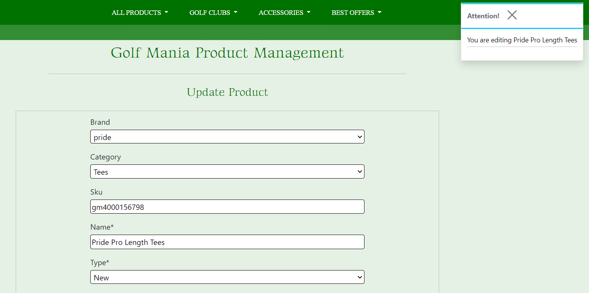
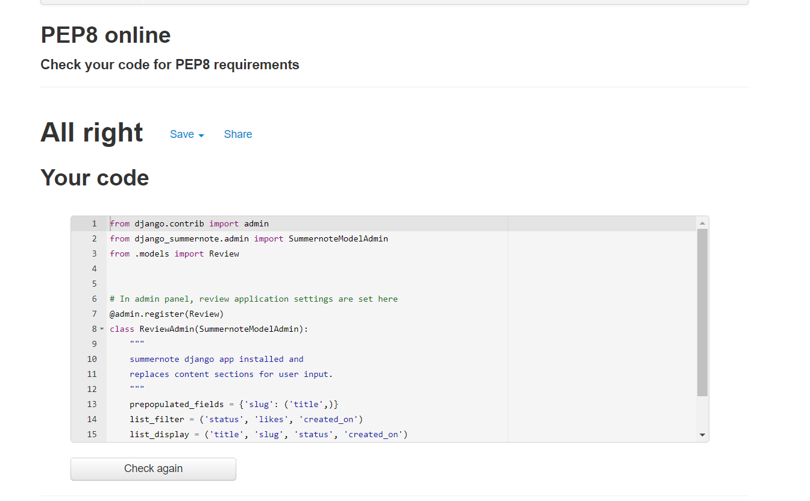
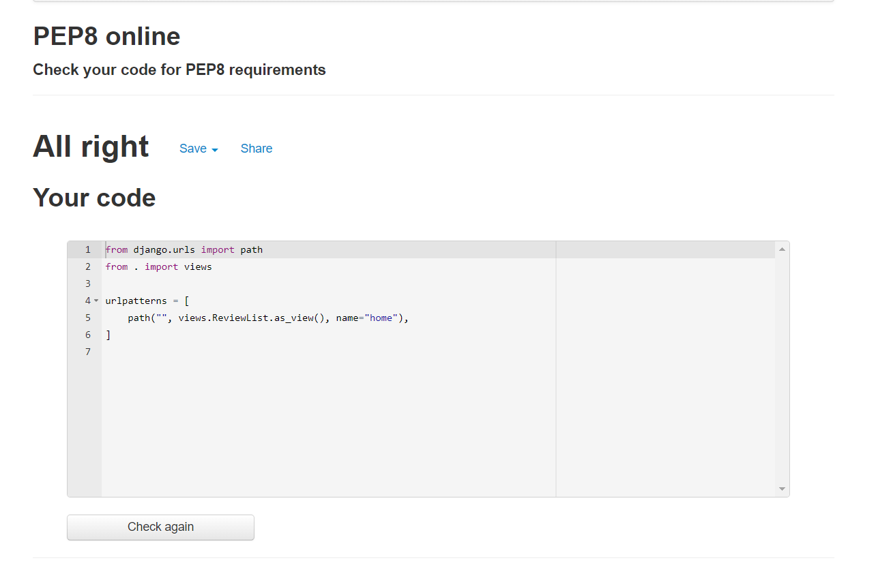
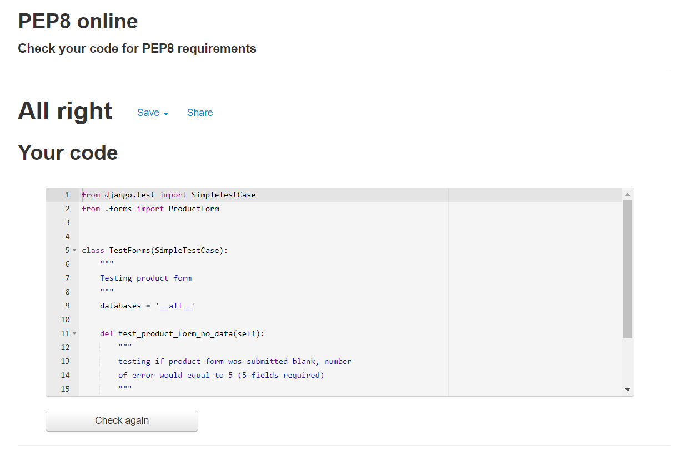
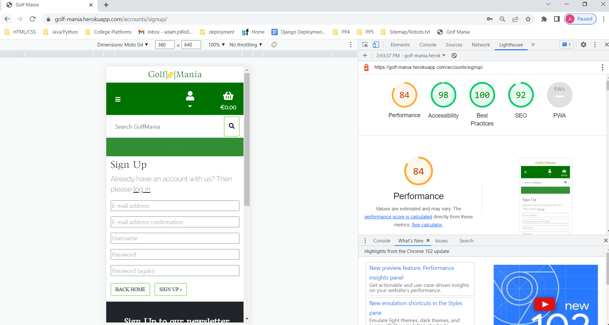
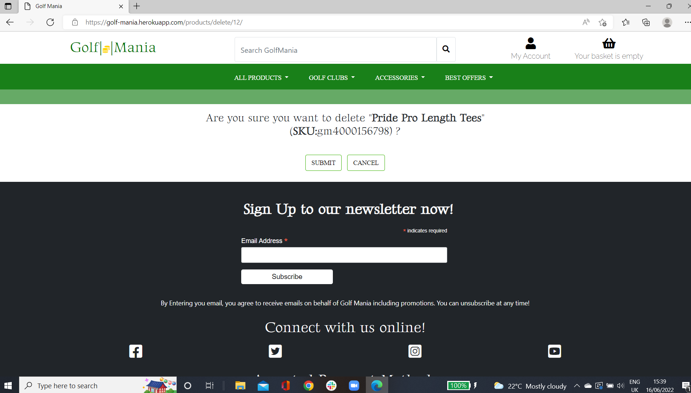

# [Golf Mania](https://golf-mania.herokuapp.com/)

### **What is Golf Mania?**

Golf Mania is an online B2C(business to customer) e-commerce web application designed to sell golf related products from Ireland. The website sells several brands in many categories and also offers an easy navigation system to allow the user to have full control of their actions during their site visit and buying experience. The web applications main aim is to sell new and used golf products from Ireland.
- Site users can browse the website and add products to their basket without the need to **register** or **log in**.
- Once logged in, the user has the **ability** to proceed to checkout and purchase items followed by confirmation.
- As a logged in user, a profile can be saved using the billing information which eases future purchases.
- Descriptive golf products with lots of interactive features throughout the purchasing experience.
- Email verification/confirmation included.

Currently, Golf Mania's website only consists of example products that can potentially be sold on the website. However, the **Project Aim** is to demonstrate how a business of any size can buy and sell products online while maintaining a high *Search Engine Optimization*. This kind of website could work with any theme/category/brand etc. This particular project focuses on selling cheap, golf equipments to its online customers. Given some given features such as uploading products could mean that this *Project* could also develop further into **Buy and Sell**.

Golf Mania currently has a low number of products and product types but given the database models, this can be expanded on quite easily from any perspective which makes it an ideal project to start off with. The project is set it up with **Stripe payment system** and billing information is saved to the project's database through **Stripe webhooks** for safer online data transfer and to **prevent** an order being generated without a *valid payment*.

A review app has been included which can also be expanded by implementing more CRUD functionality which would be beneficial for building **customer confidence**.

### **How it works?**

1. The **header** offers lots of features to the site user that they have access to at all times, from the moment they land on the site. They can search for specific items, register, log in, filter/sort specific product, read customer reviews or browse products. 

2. The landing page offers a large image that is fixed under the header with a **Welcome Message** and **eye-catching** information regarding a *Spring Sale* followed by a **button** that takes the user to view all of the products, which is the key function of the site and the reason the site user landed on the site. 

3. Site users can view **special deals** on the landing page and **reviews**. From the products page which is *accessible* through the sticky header or the landing image button. 

4. From the moment the site user starts clicking on product to view them in detail, they can use features such as *zoom in/out* or *read more* features. Products can also be added to the basket that is created as a session for them as well as **opening the basket** and **view**, **edit**, **update** and **delete** it, given all four CRUD functionalities *available* to them *without* the need to **log in**.

5. If the site wishes to proceed to check out, the **log in button** appears on the basket page. If logged in already, the continue to **secure checkout** button is available instead. 

6. As a logged in user, the site user has access to their personal profile which they can either set up *before purchasing products* or *when filling out their delivery details*, they **tick the box** to *save* their delivery information for future purchases.

7. Once the checkout form is filled out and submitted, the site user is directed to the **checkout confirm** page where they can review their order details. However, this only happens **if the payment intent is successful** to ensure no order goes through without a payment. The order data is transferred to stripe *via webhooks* and if the payment is successfull, the data is *safely* transferred back to Golf Mania's database as an *order*.

### **Who is it for?**

Ireland is home to over 200 golf courses. As a result, it has become a popular region for global golfers to visit for the *66 million* golfers worldwide and it also attracts more locals to start playing the sport. Golf Mania currently next day delivery over the delivery allowance of €80. This gives confidence for **tourists** to make cheap orders which they can receive the next day during their holiday as well as being a great online golf store for **Irish golfers** to buy cheaper products from, **used** and **new**.

**New Users**

New Users have the ability to view the website and all of its products in detail *without* the need to enter any data. However, if they wish to make full use and make a purchase, an account needs to be **registered** first which is either available through the top header or the view basket html page. Once an account is registered and **email** is *verified*, the site user has the ability to either create a profile for themselves for each future purchase or they can just **save** their delivery details during their first purchase. 

**Returning Users**

As a returning user, the site user can **log in**, **add items** to their bag, proceed to checkout and **only** fill in their *payment details*, if they have saved their information or if they have a profile set up. This speeds up their purchasing experience **substantially**. 

## **Planning**

### **Agile Planning Approach from Start to Finish**

The developer of this project has taken an Agile approach when planning out this e-commerce web application. He created and reviewed a list of **Epic Stories** which he further broke down into smaller user stories to give himself a more precise estimate of the length of time it is going to take to create the project.

**Epic User Stories**

He started off by created an **Issue Template** on Golf Mania's Github page and used it to implement each user story broken down. Each of them included a precise explanation of what the user wants followed by **Acceptance Criteria** and **Tasks** for the developer's use. *Example is shown below*.

Another **Agile tool** used to proceed with these issues was to implement the **MOSCOW Prioratization** and split these *User Stories* into 4 categories. *Must-have*, *Should-have*, *Could-have* and *Would-have* issues. A **label** for each was created and each issue was labelled in order of importance during development i.e, what features are essential for release and what features can wait until further updates.

A **Milestone** called *GolfMania E-Site* was then created on this project's Github repository where the developer **prioratized** the user stories in order of importance which offered a *clean direction* in terms of the overall, project workflow.

**Milestone Review**

**Open Issues**

 

**Closed Issues**

The developer then created a Project called **GolfMania E-Commerce Site User Stories** where he set up three columns **To Do**, **In Progress** and **Done**. This is where he moved each user story across and monitored what user stories have been completed, are in progress and what still needs to be done. The labels helped to identify the important user stories which needed to moved across first followed by should have's and etc. 

Overall, given the Epic Stories provided at the start, a total of 35 Issues were identified and further broken down into tasks. A total of **129 tasks** were created. Once each issue was labelled by the developer, out of 35, **19** issues/user stories were identified as **Must-Have** features (just under 60%) which consisted of 75 tasks out of 129 not surpassing the **60% mark** given that an **Agile Timeboxing Approach** is considered to estimate the length of the project.

### **Search Engine Optimisation Planning**

Once the project was deployed, the developer used [https://www.xml-sitemaps.com/](https://www.xml-sitemaps.com/) to create a sitemap file for Golf Mania which was then copied into a newly created **sitemap.xml** file in the main project. 

A **robots.txt** was also created where the search engine is given permission to access the website and follow every page except the urls including **/accounts/**.

The developer has also researched the Google Search Engine for key words that he can use within meta tags built into the base.html file to make it findable using the **right** keywords.

Below are examples of what the developer was researching and where the key words used in the meta tags were discovered. 

**Keyword** brainstorming in progress with the help of Search Engine Screenshots.

### **Marketing Strategies Planning**

The developer came up with a **Customer Persona** i.e, the ideal customer for the e-commerce site followed by *forms of essential marketing* that Golf Mania's project is to include. 

**Customer Persona**

**Marketing Strategies**

### **Further Planning**

The style of writing was decided through **Google Fonts**. The main writing is kept thin for a cleaner, more elegent style while the headings style was thicker.

The main theme colors were chosen on [coolors.co](https://coolors.co/palette/004b23-006400-007200-008000-38b000-70e000-9ef01a-ccff33) in order to find colours which work together very well and hence, provide a better visual experience for site users.

**Bootstrap** is used to design the overall strucuture of the website on screens of all sizes. 
[startbootstrap.com](https://startbootstrap.com/previews/landing-page) was used to choose the main strucuture of this golf web app. The link above is linked with the specific theme used for this project. 

**Custom CSS** will be used to design the visual look of the website.

**Buttons**

[codepen.io](https://codepen.io/annguyn/pen/xNVprL) was used to select an overall button style for this project.

### **HTML page structure sketches**

**1. Landing Page** 

The landing page was planned and designed by reviewing several applications with similar business goals such as [https://www.onlinegolf.eu/](https://www.onlinegolf.eu/). Each section within this page were listed in order of importance i.e. header with search features followed by landing image with view product button. Deals and offers are displayed thereafter followed by some reviews and finally, the footer which container the **Newsletter section**.

#### Landing page (Mobile View)

The main header was re-designed by the developer for mobile views to ensure all features are displayed well and look aesthetically pleasing. 

**2. Products Page** 

This is where all products can be viewed in rows of 4 on larger screens and rows of one for smaller screen. Sorting can specify the user's search. This page can accessed via the **header** or the **landing image button**.

**3. Product Detail Page**

When the user click on a specific product in any of the pages, they are taken to this page where product data is displayed.

**4. Basket Page**

When the user adds a product into their basket from the product details page, a session is created within her where the list of items added are stored and ready to interact with CRUD function created in views.py

**5. Checkout Page**

Once logged in, the user can access this page through their basket page when they are ready with their basket to make a payment.

**6. Checkout Confirm Page**

Once a payment is received via Stripe, webhooks confirm the payment and this page is rendered with the order details sent back to the database with it.

**7. Add Product Page**

Only accessibly by the superuser/admin. Accessible via the header where products can easily be added to the page.

**8. Profile Page**

Once the user is logged in, this page is also accessible via the header where delivery profile can be set up and *order history* can also be viewed.

**9. Delete product page**

Instead of automatically deleting a product with one click, this page will work as defense to ensure the admin wants this CRUD funcitonality to proceed, as it cannot be reversed.

**10. Update product page**

Accessible within each product and feature is only available to the **admin**.

**11. AllAuth custom design for Account html pages**

All of these html pages provided by allauth include different forms so therefore, the styling of all these can also be identical. 

#### **Workflow Process**

The workflow process for **New Users** and **Returning Users** when interacting with the features included within this e-commerce site. 

#### **Project Apps and Relationships**

Overall, **five main applications** were built the very least while using *Django AllAuth's user model* also. 

**Seven different models** were also planned within these five applications and how they will be linked to each other. 

The **CRUD** functionality was also planned for each application. i.e. to what extent can a Site User or Admin manipulate data built from the models as shown above. 

## 2. **Features (existing)**

All of the **buttons** throughout all of the html pages are styled and colored consistenly for enhanced visual look from a user point of view which includes **padding, background color, hover effect and text color**.

The background color of each html page is also kept identical in terms of color, mainly a **light green** color set using *RGB* and **white** in other parts for *contrast*. 

In terms of text, the website interacts with all of its users one to one when the user is logged and phrases/text content is also written as if there was **one user only**. 

### 1. **Landing Page**

#### **Header**

The header is included within *base.html* which indicates that it is displayed in every html page and it is also set **sticky** so that it follows the user as they scroll down the page.

It consists of three sections:

- The logo on the left hand side. Normally speaking, like the developer, most **users** would almost expect a website logo to **reload the home page** so to keep these type of users satisfied with this application, the **golf club name** and **logo** is a link to the home page which always follows the *user*.

- In the middle, a search bar is available for the user to type in keywords to find specific products. For example, if they're interested in golf balls, they can type golf balls find related products.

- On the right hand side, the site user can find **register** or **login** buttons which are linked with relevant AllAuth html pages followed by a basket icon which links with *basket.html*. If products are added to the basket, the price under the basket icon updates and displays the **total** of the user's basket.

**Not Signed In**

If the user is not signed in, only three features are visible.

1. **Register Button**
2. **Log in Button**
3. **Basket Icon**

**Signed In as Site User**

Once the user signs in, the two buttons are replaced with an My Account and icon which acts as a dropdown list for more features such as viewing and creating My Profile. My is used as it is from a user's point of view.

1. **Home**
2. **My Profile**
3. **Log Out**

**Signed In as Admin**

If signed in as Admin, **two** additional features are available to the **superuser** which are the **Admin Panel** and **Add Product**. Through the admin panel, the superuser has *full control* of Golf Mania database. The Add Product feature tells it function and it terms of style, it matches the overall theme of Golf Mania's website.

#### **Main Nav Bar**

Contains **4** main **dropdown lists**. The first dropdown focuses on sorting products using their *model field data* such as *price*, *rating*, *brand* etc. The other two offer the main products while the final dropdown list consists of special offers which are displayed throughout the website.

**Main Nav Closed**

**Main Nav Open**

#### **Delivery Banner**

Contains a delivery message telling the site user that over the delivery threshold, Golf Mania offers *free next day delivery* which fades in and out using **CSS in static/base.css**.

#### **Header (mobile view)**

In mobile view, all features within the header are rearranged for an enhanced visual look. The *website logo* is displayed at the top with a *direct home link*. The Main Nav dropdown lists are placed in another dropdown lists as *clickable icon*. All of the account features are now placed within in icon as a dropdown. The *log in and register buttons* are also replaced with a **dropable list**. The *search bar* is given full width as well as the *delivery banner*.

#### **Landing Image**

The landing image covers 100VH to visually attract the site users attention to the *Welcome Message and some ear catching info about the Spring Sale*. This section also contains a **View All Products** feature as a **button**.

#### **Clearance Section**

In this section, a list of category **"clearance"** products are advertised which have all been reduced in terms of price to increase the chances of catching the site users eyes and each product is *clickable* to **view in full detail** and add to their basket if they so wish. 

In terms of view, this section display **4** products on *large* screens, **2** on *medium* and **1** on *smaller* screens to maintain the size of photo for better visual design. 

#### **Reviews Section**

In this section, two reviews would be allowed to be viewed and after that, they would paginate which is built into index.html. For now, the two reviews were added via the *admin panel* to demonstrate what they would look like once the CRUD functionality of the reviews app is *developed further* to allow customers leave their on reviews which can then be approved by the admin. This is an area where external reviews could also be imported or included as images. For example, **Trustpilot** reviews.

In terms of view, this section displays **2** products on *larger* screens and **1** on smaller screens.

#### **Footer Section**

The footer contains several features which are always available to the user at the bottom of each page. It starts with a **Sign Up to Newsletter** feature which is built through **mailchimp** so each email entered is validated and saved using mailchimp.

In the middle, four external social media page icons are equally alligned starting off with *Facebook's Icon* which is linked with Golf Mania's newly built **Facebook Business Page**.

In case, the page gets deleted by Facebook, the following three images are screenshot of Golf Mania's facebook page.

At the bottom of the footer, a **payment** image is displayed which tells the user what payment types are accepted on Golf Mania's website followed by the developer's signature. The **payment image** is wrapped in an **anchor** tag which is linked with *PayPals* home page with the attribute **rel=nofollow** as it is *unrelated to the site*. 

### 2. **Products Page**

As every page, the products page includes the header and footer features. 

#### **Top Section**

When the products.html page is loaded, depending on whether a *search criteria* was entered or a *category type* through the main nav bar, a **message** on the **top right** displays the *number of products found* for the category or the *search criteria*.

Accross, a **filter** feature is available to the site user to filter products by a specific field such as by price, brand etc. All of these options will also list the filtered products in price/alphabetical order and reversed to offer **as many** filtering options to the user **as possible**. Each function works **instantly** using some *Javascript at the bottom of the page*. 

Below the above features is a **Back to Home** button that the site user can use to go back to the index page and clear any sorting/filtering options. 

#### **Products Section**

The products are listed in rows of **4** on *larger screens*, **2** on *media screens* and **1** on mobile screens. Each product is **clickable** to view each product **in detail** using *product_detail.html*. From a site user's point of view, the most important data is displayed here to spark their interest within the products. Examples, are **price**, **rating** and whether its *new* or *used*. The category type of each product is also displayed which works as a **link** if the user wants to be redirected to view a *clicked* category. 

As a site admin, two additional features are available. To **update** and **delete** a specific product.

As seen in the screenshots above, their is a *see-through up-arrow* **button** which takes the user **back to the top** of the page with a click given that all products are listed on the one page. This button is visible and available to the user through all screen sizes and works using *Javascript* at the bottom of this page.

### 3. **Product Detail Page**

#### **Image Section**

On the left hand side, the product image is 400px by 400px. When clicked, the **image** is opened in a **separate tab** for the site user to view. Below the image,** Zoom In** and **Zoom Out** features are available to the site user to maintain a good level of interactivity. 

### **Product Details Section**

The product details sections displays all the data stored for each product including the category icon which is linked with the product's specific category. To maintain a visually appealing view, only the product description is displayed with an additional features section if the user clicks the **Read More** button. If signed in as *Admin*, the **update** and **delete** functions are available in this page also.
The **rating** row is set so that any product with a *rating better than 4* will display the message **"Highly Recommended"**.

The user has full control of the quantity that the can add to the basket using the Add to Basket button. This feature is validated to ensure that at least 1 product needs to be added but no more than 99 and this is controlled with the Minus and Plus button.

Once the product is added to the basket, the user would assumingly continue shopping so a Keep Shopping button is also displayed. At this point, the basket can either be viewed using the button displayed within a **successfully added toast** or the basket icon in the main header where the total is calculated and displayed. 

#### **Newest Products Section**

In this section, a list of category **"new in"** products are advertised and each product is *clickable* to **view in full detail** and add to their basket if they so wish. Only vital, eye-catching data is displayed to maintain a large image size.

In terms of view, this section display **4** products on *large* screens, **2** on *medium* and **1** on *smaller* screens to maintain the size of photo for better visual design. 

### 4. **Basket Page**

The shopping basket page is split into two sections.

On the left hand side, all of the products within the basket are displayed in rows. The product image is smaller and also **clickable** to go back to view the product in detail again. The **quanity** can be **adjusted** by the user along with **removing** items from the basket. 

On the right hand side, the order summary is displayed with the *basket total* and a *delivery total* of €10.00 if basket total is under €80.00. An *alert message* is displayed under the delivery total if it is **chargable** while a **pleasing message** is displayed if the basket total is above €80.00. The order total is styled to stand out which is important for the user to know before proceeding. 

The feature buttons available under order summary are **Keep Shopping** which takes the user back to the products page and **Secure Checkout** if logged in or **Sign In to Continue** otherwise. The workflow process cannot continue to *checkout* unless the user is logged in.

**Shopping Basket Order Summary Logged In**

**Shopping Basket Order Summary Logged Out**

### 5. **Checkout Page**

The checkout page is also split into two sections.

On the *right hand side*, the shopping basket details are displayed for the last time followed by the order summary. The user can still go back to the basket and edit it using the **edit basket** internal link to go back to **basket.html**. The product image is also **clickable** in this section to view the product in **product_details.html** again to be sure. 

On the *left hand side*, the checkout form is displayed and validated using django forms and required fields set for vitals information for delivery purposes. 

The developer has included a field for additional information that the site user may want to share in terms of delivery. Required fields are labelled with **"*"** and a short message under the form explains this feature. If the user does not have a profile set up yet or if they need to update their profile using the typed in delivery data, there is a **Save Delivery Information** checkbox that is checked and calls a function using the Stripe payment system's webhooks. 

At the bottom of this section, the "Payment section" is imported using Stripe where payment details are entered and validated.

Below, two buttons are displayed. 

1. Back to **Basket Button**
2. **Complete Order** Button to send Stripe the validated data and take payment and a small message underneath telling the user how much they are going to be charged as a final **alert message**

For responsive design, the **Shopping Basket and Order Summary** is displayed first on smaller screens followed by the **checkout and payment form** to maintain the workflow.

### 6. **Checkout Confirm Page**

#### **Checkout Confirm Top Section**

The checkout confirm page is rendered if the payment intent is successfull. It offers a **personal Thank You message** followed by and **Shop Again Button** linked with the *products page*. At this point, a confirmation email is sent to the user confirming the order and the email receiving this is displayed at the top of the page also. 

The user has access to view order histories through their profile page. As a result, the message at the top is changed as well as the **button** to **Back to My Profile**. An *info toast* is also rendered to keep the user up to date in case they clicked into it by accident. 

### **Order Summary Section**

Below, the order summary is broken into three sections when displaying order data. **Personal**, **Delivery** and **Cost Summary** details. 

#### **Newest Products Section**

In this section, a list of category **"new in"** products are advertised and each product is *clickable* to **view in full detail** and add to their basket if they so wish. Only vital, eye-catching data is displayed to maintain a large image size.

In terms of view, this section display **4** products on *large* screens, **2** on *medium* and **1** on *smaller* screens to maintain the size of photo for better visual design. 

### 7. **Add Product Page**

This page is only available to the admin. A warm welcome message greets the superuser and below, it displays the product form using crispy forms to enhance the visual look of the form itself so that products can be instantly added to the products page and its a feature doable in an environment that matches the overall theme of the website rather than logging into the admin panel. 

The image field has been styled to match the general button style while the image file name is also displayed when one is selected. If not image is selected, the standard **no image** file will replace the empty field.

At the bottom of the form, two buttons are displayed:
1. **Cancel** - to bring the admin back to the products page.
2. **Add Product** - to add the new product to the database.

### 8. **Update Product Page**

The update product page is quite identical to the add product page. The title at the top changes to **Update Product** and an *instance* of a specific product is displayed that is changeable.

The image field displays the current image saved with an additional feature to remove the image altogether or upload a new one instead.

In terms of the buttons at the bottom, instead of the Add Product, an **Update Button** is displayed. 

### 9. **Delete Product Page**

This page is only visible to the admin again when deleting products.
It acts as an additional level of defense in case the delete function was called by mistake. The page displays the **name** and **sku** of the product selected followed by:
1. **Cancel button** - to cancel delete function and return to products.html
2. **Submit Button** - to confirm and delete product. 

### 10. **Profile Page**

The profile can be opended via the fixed top header. This page is also split into two section.

The profile form on the left hand side which can be empty or an instance of *saved delivery information*. Using the **Update Button** at the bottom of the page will update the profile at any point instantly.

If the site user has made an order using the logged in account, the previous orders will be displayed which are linked with the **Order History checkout confirm** html page as mentioned above in checkout confirm features. Only the first 7 digits of the order number are visible for each previous order and **clickable** to view them in full detail. If the orders exceed a certain amount, the order history turns into a scrollable list for better visual looks followed by a **Shop Again** button to return the user to the product page. 

When displayed on smaller screen, the profile form is shown first followed by the Order History section.

### 11. **AllAuth Form Pages**

All of the allauth form pages are designed and styled **almost identically** for better user experience. Buttons are styled identically again to keep the overall UX design style.

**Sign Up Page**

The user is asked to enter their **email twice** followed by a **username** and **password**. Email is **required** for **account features** such as *changing password and sending confirmation email* to a verified email address. Of course looking at it from a user's point of view, they may click here by mistake so a **click here** is created at the top of the form which is liked with the ***log in page***.

The new user only needs to provide a username and a strong password which is validated through AllAuth.

**Log In Page**

Given the fields required to sign up, the user is asked to enter their **email or username** followed by their **password**. From a user's perspective, incase they clicked on this tab instead of *Register*, a **sign up now** link is displayed for the user that they can click to be directed to the *Sign Up Page*.

The **Remember Me** feature is available to the user to *tick* so that their log in details are saved to improve their future booking experience. 

The **Sign In** button logs the user in and the *nav bar elements* displayed change accordingly.

**Log Out Page**

Once the user is logged in, the **LogOut** nav element comes available to them. However, rather than this function being a once click option, when the user clicks on the log out element, it directs them to the log out page where it is double checked before proceeding with this feature. 

A **cancel** link is displayed to the user if they have changed their or if they clicked on this option by mistake. It redirects the user back to the home page. 

However, if the user wishes to continue, they just have to simply click on the styled **Sign Out Button**.

The **rest of the AllAuth html pages** have also been *custom designed* to maintain the overall theme in terms of style and color.

### 12. **AllAuth Admin Panel**

The developer of this website created a nav bar element called **Admin** which only appears if the user logged in is the superuser (manager). This element is linked with Django's admin panel through which the manager is granted all of the CRUD functionality of all custom applications created as well as allauth's **user model**. They are given the ability to return to the website at any point through the link in the top right corner.

### 13. **Custom 404 error Page**

A custom 404.html page has been created with a **Home Button** incase a site user accesses the page due to deny to a certain feature. The developer demonstrated it by typing in a random url to the deployed project and it is displayed as:

### **Toasts**

Toasts have been set up as includes in templates folder to display four types of toasts in the top right hand corner. **Success**, **Warning**, **Info** and **Error**. Every action taken by any user on Golf Mania's web application is displayed using toasts to ensure every site user is kept up to date of their actions. 

## Features (new ideas) 

Given that this is the very first e-commerce project developed by the author, he discovered lots of new potential features/ideas which could be implmeneted into this project to make it more appealing, attractive and interactive from a site user's perspective in future updates. 

- Using Django AllAuth, *include social account log in options* from sites like Facebook, Instagram and Twitter using each site's developer's api keys.

- For now, reviews can only be added using the admin panel and displayed on the index page. However, **reviews** should become a **foreign key to specific products** which could be displayed as part of the product_detail html page. *Trustpilot reviews* can replace custom reviews *in index.html*. Site user's should then be given permission to access a product *review form to fill in* and await approval by the manager or validate externally.

- Include an **image gallery** of five images for each product in product_details.html.

- Add a section in index.html which focuses on providing information regarding buying second hand clubs given that the main aim of Golf Mania is to sell **new** and **used** products. This could include an image and an **external link** to a *useful* site. 

- Expand the products model to **include quality** and hand type options too which requires further update to all aspects of the app. For example, when adding to the basket, does it exist there already etc. 

- For now, only enough products were added to the database to be able to demonstrate the functionality of the overall application but the number of products can also be expanded substanstially as well as category types, brands.

- Include a **clothing** dropdown list given that *size selection feature* is already included which can be used for clothing. 

- The **signup newsletter** within the footer has been set up with mailchimp but no actual emails are sent to signed up users yet. This can be set up in the near future. 

- Create an **Instagram and Twitter pages** for Golf Mania.

- For now, products can be purchased unlimited. However, when quantity of products are limited i.e. may only have one used driver, the **quantity of a product should be set** and minus any purchases so when it reaches zero, the specific product can longer be sold again to prevent **over-buying** products.

- As the developer progressed with this project, he realised that the overall design could be further improved to make the website more appealing. For example, one idea is to change the style of the **main nav** section by creating a more appealing dropdown list for all the category types, just like the dropdown headings are displayed instead of a white box appearing with the categories within. 

## 3. Testing and Bugs Fixed/Unfixed 

Golf Mania E-Commerce Web manual and automated testing has been broken down into several stages, given its complexity, length and reliance on a database and deployment.

#### **Validator Testing**

Validation testing for this project include HTML, CSS, Javascript and Python code validation. 

**Validating HTML Pages**

[https://validator.w3.org/](https://validator.w3.org/) is used to test all html files and their code to ensure high coding standards. Base.html is not tested given that the following html pages would not work without it and the content within the base.html is displayed correctly.

All of the testing below was done through the source code of each page on the **deployed** version of the project.

**index.html**

**products.html**

**product_detail.html**

**basket.html**

**checkout.html**

One warning showing for empty heading. **The loading spinner icon** is included within the h1 header to center, style and make it larger. No **errors** however. 

**checkout_confirm.html**

**add_product.html**

**profile.html**

**update_product.html**

**delete_product.html**

**signup.html**

**login.html**

**logout.html**

**Validating CSS file**

[https://validator.w3.org/](https://jigsaw.w3.org/css-validator/) is used to test **CSS files** and their code to ensure high coding standards.

**static/css/base.css**

**profiles/static/css/profile.css**

**checkout/static/css/checkout.css**

**Validating JavaScript file**

[https://jshint.com/](https://jshint.com/) is used to test **JS** files and their code to ensure high coding standards.

**profiles/static/js/countryoption.js**

**checkout/static/js/stripe_elements.js**

**base.html JS File**

Apart from the toast function, this js script was pasted from mailchimp set up process which was followed through the guide provided in P5 study material. 

**add_product/update_product.html JS File**

**product_detail.html JS File**

**products.html JS File**

**quantity_input_js.html JS File**

Overall, 7 warnings are displayed but these warnings are okay given that the outside scope deactivated the minus button function as you cannot add less than 1 or more than 99 to the basket. And some variables are defined twice one for **increment** and one to **decrement**.

**basket.html JS File**

**Validating Python files**

[http://pep8online.com/](http://pep8online.com/) is used to test Python files and their code to ensure high coding standards.

1. ### **reviews Application**

Testing every custom **python file** within this application.

**admin.py**

**models.py**

**urls.py**

**views.py**

2. ### **profiles Application**

Testing every custom python file within this application.

**admin.py**

**forms.py**

**models.py**

**test_forms.py**

**test_urls.py**

**urls.py**

**views.py**

3. #### products Application

Testing every custom python file within this application.

**admin.py**

**forms.py**

**models.py**

**test_forms.py**

**test_urls.py**

**urls.py**

**views.py**

**widgets.py**

4. ### **home Application**

Testing every custom python file within this application.

**test_urls.py**

**urls.py**

**views.py**

5. ### **checkout Application**

Testing every custom python file within this application.

**admin.py**

**apps.py**

**forms.py**

**models.py**

**signals.py**

**test_forms.py**

**test_urls.py**

**urls.py**

**views.py**

**webhooks.py**

**webhook_handler.py**

6. ### **basket Application**

Testing every custom python file within this application.

**basket_tools.py**

**contexts.py**

**test_urls.py**

**urls.py**

**views.py**

7. ### **golfmania main Application**

**settings.py**

Five errors show for this file on PEP8. Four of these is shown within PEP8 which was automatic and unable to break into several lines.
The fifth one a static var which is similar to the above four.

**urls.py**

**custom_storages.py**

**Light-house Report**

Within DevTools, the lighthouse report is used to test overall performance of the website.

Performance has been categorised and is one element not above 90% in some pages given that some of the images take much longer to load given their size i.e. main landing image which is essential to be good quality and big to attract new site visitors. 

**Landing Page**

**Products Page**

**Product Detail Page**

**Basket Page**

**Checkout Page**

**Checkout Confirm Page**

**Add Product Page**

**Update Product Page**

**Delete Product Page**

**Profile Page**

**Register Page**

**Log In Page**

**Log Out Page**

### **Testing colour contrast**

[Coolors.co/palette](https://coolors.co/palette/004b23-006400-007200-008000-38b000-70e000-9ef01a-ccff33) site was used to chose the color theme for the project as it provides a set of colors which work well together and the contrast perfect.

### **Search Engine Testing**

This project was tested through three several search engines including Google Chrome which is the creator's default search engine. Internet Explorer was not included below given its lack of popularity. 

1. **Google Chrome (default)**

2. **Mozilla Firefox**

Each section displayed as a page was tested and checked through ***Mozilla Firefox*** and no issues detected.

**Landing Page**

**Products Page**

**Product Detail Page**

**Basket Page**

**Checkout Page**

Some issues identified regarding rows and columns via Mozilla Firefox. The developer has identified this issue. However, in order to ensure that it does not conflic with original project which is tested, this will only be fixed during another update.

**Checkout Confirm Page**

**Add Product Page**

**Update Product Page**

**Delete Product Page**

**Profile Page**

**Register Page**

**Log In Page**

**Log Out Page**

**Admin Page**

3. **Microsoft Edge**

Each section displayed as a page was tested and checked through ***Microsoft Edge*** and no issues detected.

**Landing Page**

**Products Page**

**Product Detail Page**

**Basket Page**

**Checkout Page**

No problem with this page on Microsoft Edge.

**Checkout Confirm Page**

**Add Product Page**

**Update Product Page**

**Delete Product Page**

**Profile Page**

**Register Page**

**Log In Page**

**Log Out Page**

**Admin Page**

### **Application Features Test**

#### **Automated Testing**

Some automated testing has been completed on this project. This website consists of **six** separate applications. Within **5** of these, files **urls.py** and **forms.py** have been tested and overall, **18** automated tests are running error free.

### **1. profiles application**

**test_forms.py**: **One** automated tests running successfully to test for correct number of errors (required fields) come back when no data is submitted. 

**test_urls.py**: **Two** automated tests running successfully to check CRUD functionality url paths created for profile view function.

### **2. products application**

**test_forms.py**: **One** automated tests running successfully to test for correct number of errors (required fields) come back when no data is submitted. 

**test_urls.py**: **Four** automated tests running successfully to check ALL CRUD functionality url paths for all products app view functions.

### **3. home application**

**test_urls.py**: **One** automated tests running successfully to check if index.html is rendered.

### **4. checkout application**

**test_forms.py**: **One** automated tests running successfully to test for correct number of errors (required fields in checkout form) come back when no data is submitted. 

**test_urls.py**: **Four** automated tests running successfully to check ALL CRUD functionality url paths for checkout app.

### **5. basket application**

**test_urls.py**: **Four** automated tests running successfully to check ALL CRUD functionality url paths for basket views urls.

#### **Manual Testing**

While the developer is fully aware of the advantages of full automated testing, he made a decisions to test the rest of the project manually in detail as result of the **upcoming due date**.

### **1. index.html features**

- **Header**
    - **Header logo and club name** reloads index.html = **true**
    - **Search Bar** finds products related to typed in key words = **true**
    - **Register Button** only visible if logged out = **true**
    - **Log In** only visibile if logged out = **true**
    - **My Account Icon** only visibile if logged in = **true**
    - **Home Dropdown** only visibile if logged in = **true**
    - **Home Dropdown** reloads index.html = **true**
    - **My Profile** only visibile if logged in = **true**
    - **My Profile** loads profile.html = **true**
    - **Log Out** only visibile if logged in = **true**
    - **Log Out** loads logout.html = **true**
    - **Add Product** only visibile if logged in as ADMIN = **true**
    - **Add Product** loads add_product.html = **true**
    - **Admin Panel** only visibile if logged in as ADMIN= **true**
    - **Admin Panel** loads /admin/ = **true**
    - **Basket Icon** loads basket.html = **true**
    - **Basket Icon Message** changes to total if Not empty = **true**

- **Main Nav**
    - **All Products** loads dropdown list = **true**
        - **By Price** filters products by price = **true**
        - **By Rating** filters products by rating = **true**
        - **By Category** filters products by category = **true**
        - **By Brand** filters products by brand = **true**
        - **By Condition** filters products by condition = **true**
        - **All Products** displays all product = **true**

    - **Golf Clubs** loads dropdown list = **true**
        - **Putters** filters products by category "putters" = **true**
        - **Irons** filters products by category "irons" = **true**
        - **Sandwedges** filters products by category "sandwedges" = **true**
        - **Woods** filters products by category "woods" = **true**
        - **Drivers** filters products by category "drivers" = **true**
        - **All Clubs** filters products by ALL categories = **true**

    - **Accessories** loads dropdown list = **true**
        - **Tees** filters products by category "tees" = **true**
        - **Gloves** filters products by category "gloves" = **true**
        - **Golf Balls** filters products by category "balls" = **true**
        - **Caps** filters products by category "caps" = **true**
        - **All Accessories** filters products by ALL above categories = **true**

    - **Best Offers** loads dropdown list = **true**
        - **New In** filters products by category "new_in" = **true**
        - **Deals** filters products by category "deals" = **true**
        - **Clearance** filters products by category "clearance" = **true**
        - **All Offers** filters products by ALL above categories = **true**

- **Delivery Banner**
    - **Delivery Text** fades out and in upon reload = **true**

- **Landing Image**
    - **"Browse Now"** button hover effect = **true**
    - **"Browse Now"** button redirects to *products.html* = **true**
    - Landing Image fixed for better UX Design = **true**

- **Clearance Section**
    - Displays clearance cateogry products = **true**
    - Each product loads *product_detail.html* when clicked on = **true**
    - *Highly Recommended Rating* only displays if rating > 4 = **true**

- **Review Section**
    - Correct Data displayed as expected = **true**
    - 2 reviews per paginated page = **true**

- **Footer Section**
    - Signup Newsletter correctly set up with Mailchimp = **true**
    - Signup Newsletter email input validation = **true**
    - *Success Message* if using Sign Up feature = **true**
    - Social Media Icons equally positioned = **true**
    - Icons background color match buttons = **true**
    - Icons hover effect match anchor hover effect in terms of colour = **true**
    - *Facebook* icon visible = **true**
    - *Facebook* icon linked with Golf Mania's Facebook URL = **true**
    - Facebook URL opens in new tab = **true**

    - *Twitter* icon visible = **true**
    - *Twitter* icon linked with Twitter URL = **true**
    - Twitter URL opens in new tab = **true**

    - *Instagram* icon visible = **true**
    - *Instagram* icon linked with Instagram URL = **true**
    - Instagram URL opens in new tab = **true**

    - *Youtube* icon visible = **true**
    - *Youtube* icon linked with Youtube URL = **true**
    - Youtube URL opens in new tab = **true**

    - **Payment Method** image responsive = **true**
    - **Payment Method** image opens in new page = **true**
    - **Payment Method** image open Paypal home page = **true**
    
- ### **2. products.html features**
    - *Search criteria message* displays number of products found = **true**
    - *Search criteria message* search key word if search bar used = **true**

    - **Sort Features**
        - Price high to low function working = **true**
        - Price low to high function working = **true**
        - Rating high to low function working = **true**
        - Rating low to high function working = **true**
        - Name high to low function working = **true**
        - Name low to high function working = **true**
        - Category high to low function working = **true**
        - Category low to high function working = **true**
        - Brand high to low function working = **true**
        - Brand low to high function working = **true**
        - Type high to low function working = **true**
        - Type low to high function working = **true**
        - Each function working **instantly** - **true**

    - **Back to Home** button reloads index.html = **true**
    - Products displayed in rows of 4 on large screens = **true**
    - Products displayed in rows of 2 on medium screens = **true**
    - Products displayed in rows of 1 on smaller screens = **true**
    - product_details.html opens when **clicked** on specific product = **true**
    - Product category internal link filters *category type* = **true**
    - **Update Button** only visible to ADMIN = **true**
    - **Update Button** renders update_product.html = **true**
    - **Delete Button** only visible to ADMIN = **true**
    - **Delete Button** renders delete_product.html = **true**
    - **Back To the Top Button** scrolls to the top when *clicked* = **true**
    - **Back To the Top Button** visible and working on all screens = **true**

- ### **3. product_detail.html features**
    - Product Image opens in external file when clicked = **true**
    - **Zoom In +** button zooms in image by 50px = **true**
    - **Zoom Out -** button zooms out image by 50px = **true**
    - Product category internal link filters *category type* on the right = **true**
    - **Update Button** only visible to ADMIN = **true**
    - **Update Button** renders update_product.html = **true**
    - **Delete Button** only visible to ADMIN = **true**
    - **Delete Button** renders delete_product.html = **true**
    - **Read More** only visible if feature field is filled in for product = **true**
    - **Read More** opens dropdown features as text = **true**
    - **Read Less Button** appears when opened = **true**
    - **Read Less Button** closes additional features = **true**
    - **Hand Size Input** function works as expected = **true**
    - **Hand Size Input** function works POST data sent successfully = **true**
    - **Quantity Input** cannot be < 1 = **true**
    - **Quantity Input** cannot be > 99 = **true**
    - **Quantity Input -** button hover effect = **true**
    - **Quantity Input -** updates quantity correctly = **true**
    - **Quantity Input +** button hover effect = **true**
    - **Quantity Input +** updates quantity correctly = **true**
    - **"Keep Shopping"** button hover effect = **true**
    - **"Keep Shopping"** button redirects to *products.html* = **true**
    - **"Add To Basket"** button hover effect = **true**
    - **"Add To Basket"** button adds product to basket as item = **true**
    - *"Success"* toast confirms basket update = **true**

    - **Newest Products Section**
        - Displays new_in cateogry products = **true**
        - Each product loads *product_detail.html* when clicked on = **true**
        - *Highly Recommended Rating* only displays if rating > 4 = **true**

- ### **4. basket.html features**
    - Display correct number of items in basket above list of products = **true**
    - Product image opens *product_detail.html* = **true**
    - Product image opens *product_detail.html* = **true**
    - **Quantity Input** cannot be < 1 = **true**
    - **Quantity Input** cannot be > 99 = **true**
    - **Quantity Input -** button hover effect = **true**
    - **Quantity Input -** updates quantity correctly = **true**
    - **Quantity Input +** button hover effect = **true**
    - **Quantity Input +** updates quantity correctly = **true**
    - **Update Button** updates quantity selected = **true**
    - **Remove Button** removes basket items selected = **true**
    - DATA displayed correctly under Order Summary = **true**
    - "Keep Shopping" **button** hover effect = **true**
    - "Keep Shopping" **button** redirects to *products.html* = **true**
    - **"Sign In To Continue"** button hover effect = **true**
    - **"Sign In To Continue"** button displayed when logged out = **true**
    - **"Secure Checkout"** button hover effect = **true**
    - **"Secure Checkout"** button displayed when logged in = **true**

- ### **5. checkout.html features**
    - checkout_form displayed as crispy form on the left = **true**
    - checkout_form does NOT submit if required fields empty = **true**
    - checkout_form validated before submission = **true**
    - checkout_form prefilled if profile exists = **true**
    - checkout_form save delivery info feature working = **true**
    - stripe payment form validated = **true**
    - **left arrow button** hover effect = **true**
    - **left arrow button** loads basket.html = **true**
    - **Complete Order button** hover effect = **true**
    - **Complete Order button** submits checkout/payment form to stripe = **true**
    - **Complete Order button** renders spinning icon = **true**
    - Spinning Icon darkens background = **true**
    - **"Edit Basket"** hover effect = **true**
    - **"Edit Basket"** loads basket.html = **true**

- ### **6. checkout_confirm.html features**
    - DATA rendered as expected = **true**
    - **Shop Again Button** hover effect = **true**
    - **Shop Again Button** loads *products.html* = **true**
    - **Email** sent with order data = **true**
    - **Newest Products Section**
        - Displays new_in cateogry products = **true**
        - Each product loads *product_detail.html* when clicked on = **true**
        - *Highly Recommended Rating* only displays if rating > 4 = **true**

- ### **7. add_product.html features**
    This form has one automated test which is test the number of required fields. If not data was entered, 5 errors would occur for category, name, type description and price so statement is **true**
    - product form displayed as crispy = **true**
    - **Choose Image** button hover effect = **true**
    - **Choose Image** button opens computer files = Yes **BUT** not when **pointing**... only on the side of button!
    - Upload image from computer using **Choose Image** = **true**
    - Name of image file displayed under button = **true**
    - product form validation when **Add Product** pressed = **true**
    - **Cancel** button hover effect = **true**
    - **Cancel** button loads products.html = **true**
    - **Add Product** button hover effect = **true**
    - **Add Product** button saves and loads product_detail.html = **true**
    - IF no image uploaded - default image displayed = **true**
    

- ### **8. update_product.html features**
    The update product form is using the same product form as add _product so therefore the number of errors when no data is 5 also and is validated the same way. 
    - **Testing Changes**
        - Product form instance data prefilled = **true**
        - Image Field display "Current Image" = **true**
        - **Remove Check Box** removes image when form update = **true**
        - *Choose Image* button upload new image if requested = **true**
        - **Add Product** button hide = **true**
        - **Update Product** displayed = **true**
        - **Update Product** button hover effect = **true**
        - **Update Product** button saves and loads product_detail.html = **true**
        - **User feedback** toast displayed = **true**

- ### **9. delete_product.html features**
    - **Warning Message** includes product name and SKU = **true**

    - **Submit** button displayed = **true**
    - **Submit** button hover effect = **true**
    - **Submit** button submits delete request = **true**
    - **Submit** button reloads products.html = **true**
    - **User feedback** toast displayed = **true**

    - **Cancel** button displayed = **true**
    - **Cancel** button hover effect = **true**
    - **Cancel** button reloads view_bookings.html = **true**

- ### **10. profile.html features**
    - **Delivery Form Section**
        - Profile form displaying instance of user info, if ANY = **true**
        - Empty profile form if no data = **true**
        - No required fields = **true**
        - Form Validation = **true**
        - **Update Profile Button** updating profile data in database = **true**
        - **Update Profile Button** hover effect = **true**
        - **Update Profile Button** always overwrites data = **true**

    - **Order History Section**
        - Orders in rows and scroll bar appear = **true**
        - **Order number** loads checkout_confirm.html = **true**
        - IN CHECKOUT_CONFIRM.html(everything else the same)
            - *Header* changes to "Order History" = **true**
            - **Back to MY Profile Button** display = **true**
            - **Shop Again Button** hide = **true**
            - **Back to MY Profile Button** hover effect = **true**
            - **Toast** warning user of action = **true**

- ### **11. signup.html features**
    - *Log In* header link hover effect = **true**
    - *Log In* loads login.html = **true**
    - *Username field* required = **true**
    - *Email field* required = **true**
    - Password required and validated = **true**
    - Email verification via AllAuth = **true**
    - Email verification link SUCCESS = **true**
    - User feedback message "Successfully signed in displayed" = **true**
    - "Back Home" button hover effect = **true**
    - "Back Home" button load index.html = **true**
    - "Sign Up" button hover effect = **true**
    - "Sign Up" button submit allauth user form = **true**

- ### **12. login.html features**
    - *Sign up now* header link hover effect = **true**
    - *Sign up now* loads signup.html = **true**
    - *Username/Email field* required = **true**
    - Password required and validated = **true**
    - Remember Me feature visible = **true**
    - **Forgot Password** loads reset_password.html = **true**
    - "Sign In" button hover effect = **true**
    - "Sign In" button submits allauth user sign in form = **true**
    - User feedback message "Successfully signed in as username" = **true**

- ### **13. logout.html features**
    - *Cancel* link hover effect = **true**
    - *Cancel* loads index.html = **true**
    - "Sign Out" button hover effect = **true**
    - "Sign Out" button submits allauth user sign in form = **true**
    - User feedback message "You have signed out" = **true**

### **Testing Responsiveness**

[Am I Responsive](http://ami.responsivedesign.is/) website was used to test the responsiveness of Golf Mania's E-Commerce Web Application on several devices deferring in sizes "from small to large".

This website was also used to test the **web features on all screen sizes**.

**Landing Page**

**Products Page**

**Product Detail Page**

**Basket Page**

Unable to present a screenshot given that *Am I Responsve* does not have access to go further within this e-commerce application. Howver, this page has been testing on several devices of different screen sizes.

**Checkout Page**

Unable to present a screenshot given that *Am I Responsve* does not have access to go further within this e-commerce application. Howver, this page has been testing on several devices of different screen sizes.

**Checkout Confirm Page**

Unable to present a screenshot given that *Am I Responsve* does not have access to go further within this e-commerce application. Howver, this page has been testing on several devices of different screen sizes.

**Profile Page**

Unable to present a screenshot given that *Am I Responsve* does not have access to go further within this e-commerce application given that the user is not logged in and unable to log in using this testing platform. Howver, this page has been testing on several devices of different screen sizes.

**Add Product Page**

Unable to present a screenshot given that *Am I Responsve* does not have access to go further within this e-commerce application given that the user is not logged in and unable to log in using this testing platform. Howver, this page has been testing on several devices of different screen sizes.

**Update Product Page**

Unable to present a screenshot given that *Am I Responsve* does not have access to go further within this e-commerce application given that the user is not logged in and unable to log in using this testing platform. Howver, this page has been testing on several devices of different screen sizes.

**Delete Product Page**

Unable to present a screenshot given that *Am I Responsve* does not have access to go further within this e-commerce application given that the user is not logged in and unable to log in using this testing platform. Howver, this page has been testing on several devices of different screen sizes.

**Register Page**

**Log In Page**

**Log Out Page**

Unable to present a screenshot given that *Am I Responsve* does not have access to go further within this e-commerce application given that the user is not logged in and unable to log in using this testing platform. Howver, this page has been testing on several devices of different screen sizes.

### **Other ways of testing responsiveness and features**

Multiple family members and friends were asked to test this new application on their mobile phones and overall, the only mobile identifying some margin/padding errors and payment image size error in the footer was the **Samsung Galaxy SE**. 

Another issue identified by one tester was that the account dropdown caused an overlay on their device so they could scroll a bit to the right. Fixed by adding right margin to the [data bs element] in base.css

### **Fixed Bugs**

1. The margin issue which caused the screen size width to be more than 100% was identified and fixed.

2. The developer had issues with the dropdown list displaying correctly in the top header. He wanted to reuse a piece of code which did not work as expected. Discovered the **Bootstrap5** update and following documentation, issue was fixed and displaying correctly. 

3. Issues with zoom in and zoom out functionality. ZoomIn and ZoomOutdid not work. Fixed issue by changing maximum-size of img-fluid class to allow zoom in option to work. Issue solved efficiently using INSPECT given that the JS function to work it was set correctly. 

4. Issues setting up toast. Toast did not display card filled with data. Bootstrap5 update included changes so fixed issue using *documentation*. 

5. Z-Index issues with data displayed on index.html. Header did not hide landing image when set fixed. Fixed issue by reading into Z-Index documentation. 

6. Top Margin issues with fixed header. Issue fixed using **Media Queries**.

### **Unfixed Bugs**

The only identified unfixed bug currently is the **Mouse Pointer** but in image field of product_form. The button functions and works fine but not when mouse is pointing at it. The **button** is clickable in some areas so it is useable and does not affect the overall application feature from customer/site user's point of view but will need to be fixed.

The structure issue identified above within the **checkout page** using **Mozilla Firefox** but it will not be solved until next update given the time it takes to retest features again if *restructuring* is necessary.

No other issues identified during automated or manual testing. 

## 4. Deployment

For deployment, GitHub is used to push data from production environment and HEROKU is used to run the web application and POSTGREs database. 

The steps needed to take to deploy this project are as follows: 

**In Gitpod** - After project set up and libraries required installed to workspace.

**1.** Create **requirements.txt** file and ensure it is **up to date** before deployment.

**In Heroku**

**2.** Create the **Heroku app**.

**3.** Attach the **POSTGRES database** to the app **through *Resources* tab**.

**4.** Copy DATABASE_URL value which is located in the Settings Tab, click reveal Config Vars, Copy Text.

**In Gitpod**

##### *env.py*

**5.** Create new **env.py file** on top level directory.

**6.** **Import os library**.

**7.** Set **environment variables** to "**os.environ["DATABASE_URL"] = "Paste in Heroku DATABASE_URL Link**".

**8.** Add in **secret key** - **os.environ["SECRET_KEY"] = "Golf Mania's own secret key"**.

**In Heroku**

**9.** Add Secret Key to ** - **SECRET_KEY, “GolfManiaSecretKey”**.

**In Gitpod**

##### *settings.py*

**10.** Reference **env.py** like below.

**import os**
**import dj_database_url**

**if os.path.isfile("env.py"):**
   **import env**

**11.** **Remove** the insecure **secret key** and replace - links to the **SECRET_KEY variable on Heroku**

**SECRET_KEY = os.environ.get('SECRET_KEY')**

**12.** **Comment out** the old DataBases Section

DATABASES = {
    'default': {
        'ENGINE': 'django.db.backends.sqlite3',
        'NAME': BASE_DIR / 'db.sqlite3',
    }
}

**13.** Add **new DATABASES** Section (links to the DATATBASE_URL variable on Heroku)

DATABASES = {
   'default': dj_database_url.parse(os.environ.get("DATABASE_URL"))
}

**14.** In terminal, save all files using **git push** and **migrate** all data models to make they're up to date.

**In Amazon Web Services.com(AWS)**

- Register/Create an account.
- Create a new S3 Bucket using **changes sheet**.
- Set up Bucket settings as showns in **changes sheet**
- Bucket Policy unchanged. 
- For Access Control list, select **Public**
- In Identify and Access Management (IAM)
    - Create a new group.
    - Create a new policy and click to *review policy* page.
    - In User Groups, select **Permissions Tab**, **Add Permission** and attach policies.
- Install **boto3**
- Install **django_storages** and add to installed apps in *Settings.py*.
- Freeze requirements.txt
- In settings.py set up variables
    1. AWS_S3_OBJECT_PARAMETERS = 
    2. AWS_STORAGE_BUCKET_NAME = 
    3. AWS_S3_REGION_NAME =
    4. AWS_ACCESS_KEY_ID = os.environ.get('')
    5. AWS_SECRET_ACCESS_KEY = os.environ.get('')
    6. AWS_S3_CUSTOM_DOMAIN = 

**In Heroku**

**17.** Add **AWS URL Variables** to Heroku through app **settings tab**, **Config Vars** (AWS_SECRET_ACCESS_KEY) and (AWS_ACCESS_KEY_ID)

**18.** Add **DISABLE_COLLECTSTATIC** to Heroku **Config Vars** (temporary) (**DISABLE_COLLECTSTATIC, 1**)

**In settings.py**

**19.** Set variables for (EMAIL_HOST_USER) and (EMAIL_HOST_PASS) to allow for real emails.

**In Heroku**

- Set variables for email as above with correct email and password. 

**20.** In **settings.py** tell django to **use custom_storages to store media and static files**.

STATIC_URL = '/static/'

STATICFILES_STORAGE = 'custom_storages.StaticStorage'
    STATICFILES_LOCATION = 'static'
    DEFAULT_FILE_STORAGE = 'custom_storages.MediaStorage'
    MEDIAFILES_LOCATION = 'media'
    STATIC_URL = f'https://{}/{STATICFILES_LOCATION}/'
    MEDIA_URL = f'https://{}/{MEDIAFILES_LOCATION}/'

**21.** Link file to the templates directory in Heroku (place under the BASE_DIR line).

TEMPLATES_DIR = os.path.join(BASE_DIR, **'templates'**)

**22.** Change the templates directory to TEMPLATES_DIR (place within the TEMPLATES array).

TEMPLATES = [
    {
        …,
        'DIRS': **[TEMPLATES_DIR]**,
       …,
            ],
        },
    },
]

**23.** Add **Heroku Hostname to ALLOWED_HOSTS**.

ALLOWED_HOSTS = [**"PROJ_NAME.herokuapp.com"**, "localhost"]

**24.** Create **3 new folders** on top level directory (**media, static, templates**).

**25.** Create **procfile** on the top level directory called **Procfile**.

**In Procfile**

**26.** Add the following: **web: gunicorn PROJ_NAME.wsgi**.

**27.** **Git Add, Commit and Push** to save files.

**28.** Once project is complete:

- In Heroku, **config var**s, remove **DISABLE STATIC**.

- In GitPod, go to **settings.py** and set **DEBUG** to **False**.

**29.** Add Stripe Public, Secret and Webhook key to **Heroku** config variables in settings.py.

**30.** **update requirements.txt** (pip3 freeze....).

**31.** Finally, **save** files again. (**Git add, commit, push**).

**32.** In Heroku, go to the **Deploy tab** and *link* github project with Heroku app.

**33.** Scroll to the bottom, **enable automatic deploys** for further changes.

**34.** Click on **Deploy Branch**.

**35.** Go to **Actions Tab** and monitor deployment.

## 5. **Credits**

## Content

### **Images**

**Main Landing Image**

**owner** = Me and my golf

**Link**: [https://meandmygolf.com/wp-content/uploads/2021/03/Woflie-Preset-0439-min-scaled.jpg ](https://meandmygolf.com/wp-content/uploads/2021/03/Woflie-Preset-0439-min-scaled.jpg )

**Footer Payment Image**

**owner** = Zazzle Help Center

**Link**: [https://help.zazzle.com/hc/article_attachments/360023193074/payment_Capture.JPG ](https://help.zazzle.com/hc/article_attachments/360023193074/payment_Capture.JPG  )

**Callaway Glove One**

**owner** = Amazon

**Link**: [ https://images-na.ssl-images-amazon.com/images/I/514tS9U+zkL.jpg ](https://images-na.ssl-images-amazon.com/images/I/514tS9U+zkL.jpg  )

**Callaway Glove Two**

**owner** = Hotukdeals

**Link**: [https://abclive1.s3.amazonaws.com/a636a571-361b-4659-a8dc-bf75b5a14aac/productimage/P-SR7H201SRICABRETTALEATHGLOVEWHITEGRH___L.jpg ](https://abclive1.s3.amazonaws.com/a636a571-361b-4659-a8dc-bf75b5a14aac/productimage/P-SR7H201SRICABRETTALEATHGLOVEWHITEGRH___L.jpg )

**footjoy gloves**

**owner** = WCS Store

**Link**: [https://www.tgw.com/wcsstore/CatalogAssetStore/Attachment/images/products/golf/P122061/white-2-f.jpg ](https://www.tgw.com/wcsstore/CatalogAssetStore/Attachment/images/products/golf/P122061/white-2-f.jpg  )

**titleist gloves**

**owner** = Left Handed Golf

**Link**: [https://www.lefthandedgolf.co.uk/content/images/thumbs/0006012_titleist-players-gloves-for-the-left-handed-golfer-3-pack_600.jpeg ](https://www.lefthandedgolf.co.uk/content/images/thumbs/0006012_titleist-players-gloves-for-the-left-handed-golfer-3-pack_600.jpeg  )

**Ping Gloves**

**owner** = Ping Media Stage

**Link**: [https://pingmediastage.azureedge.net/mediastorage/mediastorage/ping-na/medialibrary/ecommerce/2020/gloves/ping_tour-back_h__0673_708x708.jpg  ](https://pingmediastage.azureedge.net/mediastorage/mediastorage/ping-na/medialibrary/ecommerce/2020/gloves/ping_tour-back_h__0673_708x708.jpg   )

**Pride professional tees**

**owner** = onlineEUgolf.eu

**Link**: [https://www.onlinegolf.eu/dw/image/v2/AAKY_PRD/on/demandware.static/-/Sites-master-catalog/default/dw5bed8f1e/images-square/zoom/344047-Pride-Professional-Tees-2.jpg?sw=635 ](https://www.onlinegolf.eu/dw/image/v2/AAKY_PRD/on/demandware.static/-/Sites-master-catalog/default/dw5bed8f1e/images-square/zoom/344047-Pride-Professional-Tees-2.jpg?sw=635  )

**Pride professional pro-length-plus**

**owner** = Google Images

**Link**: [https://abclive1.s3.amazonaws.com/a636a571-361b-4659-a8dc-bf75b5a14aac/productimage/CL3H902BLUE%20314___1___L.jpg ](https://abclive1.s3.amazonaws.com/a636a571-361b-4659-a8dc-bf75b5a14aac/productimage/CL3H902BLUE%20314___1___L.jpg  )

**Pride mini tees**

**owner** = www.golfonline.co.uk

**Link**: [https://static.golfonline.co.uk/media/img/tewpt10_ex1.600x600.jpg ](https://static.golfonline.co.uk/media/img/tewpt10_ex1.600x600.jpg  )

**Pro-length 2-3/4**

**owner** = Google Images

**Link**: [https://abclive1.s3.amazonaws.com/a636a571-361b-4659-a8dc-bf75b5a14aac/productimage/CL3H902YELLO234___5___L.jpg ](https://abclive1.s3.amazonaws.com/a636a571-361b-4659-a8dc-bf75b5a14aac/productimage/CL3H902YELLO234___5___L.jpg  )

**CG Long Cushion Top Tees – 72mm**

**owner** = www.colegolf.ie

**Link**: [https://colegolf.ie/rubber_golf_tees.jpg ](https://colegolf.ie/rubber_golf_tees.jpg  )

**Golf plastic tees**

**owner** = www.colgansports.ie

**Link**: [https://www.colgansports.ie/wp-content/uploads/2022/03/image-asset-e1648040805831.jpeg ](https://www.colgansports.ie/wp-content/uploads/2022/03/image-asset-e1648040805831.jpeg  )

**Taylormade black cap**

**owner** = www.sportsdirect.ie

**Link**: [https://images.sportsdirect.com/images/products/36810003_l.jpg ](https://images.sportsdirect.com/images/products/36810003_l.jpg  )

**Callaway rogue st ls fairway wood**

**owner** = www.golfonline.co.uk

**Link**: [https://static.golfonline.co.uk/media/img/rogue-st-ls-fairway-2022-sole-b.600x600.jpg  ](https://static.golfonline.co.uk/media/img/rogue-st-ls-fairway-2022-sole-b.600x600.jpg   )

**Titleist vokey sm4 single 54**

**owner** = Google Images

**Link**: [https://trademe.tmcdn.co.nz/photoserver/full/1614648863.jpg ](https://trademe.tmcdn.co.nz/photoserver/full/1614648863.jpg  )

**Srixon ZX5 Driver**

**owner** = GolfDigest

**Link**: [https://golfdigest.sports.sndimg.com/content/dam/images/golfdigest/fullset/2021/hotlist-2021/drivers/revised-hero-images/EDIT_CLUBS_0007_GD0221_HL_DRIVER_SRIXON_ZX7_HERO.jpg.rend.hgtvcom.1850.1850.suffix/1612884822586.jpeg ](https://golfdigest.sports.sndimg.com/content/dam/images/golfdigest/fullset/2021/hotlist-2021/drivers/revised-hero-images/EDIT_CLUBS_0007_GD0221_HL_DRIVER_SRIXON_ZX7_HERO.jpg.rend.hgtvcom.1850.1850.suffix/1612884822586.jpeg  )

**Used color golf balls image**

**owner** = www.twoguyswithballs.com

**Link**: [https://twoguyswithballs.com/wp-content/uploads/color-used-golf-balls-mix.jpg ](https://twoguyswithballs.com/wp-content/uploads/color-used-golf-balls-mix.jpg  )

**Titleist pro v1 balls**

**owner** = www.onlinegolf.eu

**Link**: [https://www.onlinegolf.eu/on/demandware.static/-/Sites-master-catalog/default/dw5ae6ee14/images-square/zoom/369394-White-Titleist-Pro-V1-12-Ball-Pack-2021-1.jpg  ](https://www.onlinegolf.eu/on/demandware.static/-/Sites-master-catalog/default/dw5ae6ee14/images-square/zoom/369394-White-Titleist-Pro-V1-12-Ball-Pack-2021-1.jpg   )

**Callaway golf bag**

**owner** = www.americangolf.eu

**Link**: [https://www.americangolf.eu/on/demandware.static/-/Sites-master-catalog/default/dw67459810/images-square/zoom/317894-1.jpg ](https://www.americangolf.eu/on/demandware.static/-/Sites-master-catalog/default/dw67459810/images-square/zoom/317894-1.jpg  )

**Ping g410 hybrid**

**owner** = Google Images

**Link**: [https://pingmediastage.azureedge.net/mediastorage/mediastorage/ping-na/medialibrary/clubs/hybrids/g410/g410_hybrid_3-19_sole_708x708.jpg  ](https://pingmediastage.azureedge.net/mediastorage/mediastorage/ping-na/medialibrary/clubs/hybrids/g410/g410_hybrid_3-19_sole_708x708.jpg   )

**Players 4+ StaDry Stand Bag Charcoal**

**owner** = Google Images

**Link**: [https://www.google.com/url?sa=i&url=https%3A%2F%2Fwww.mcguirksgolf.com%2Fp%2Ftitleist-players-4-stadry-stand-bag--charcoal---white---red%2Ftb21sx3003&psig=AOvVaw2ZIb_a2k4SbPlfUxm1araa&ust=1654162325889000&source=images&cd=vfe&ved=0CAkQjRxqFwoTCMiSgLD5i_gCFQAAAAAdAAAAABAG  ](https://www.google.com/url?sa=i&url=https%3A%2F%2Fwww.mcguirksgolf.com%2Fp%2Ftitleist-players-4-stadry-stand-bag--charcoal---white---red%2Ftb21sx3003&psig=AOvVaw2ZIb_a2k4SbPlfUxm1araa&ust=1654162325889000&source=images&cd=vfe&ved=0CAkQjRxqFwoTCMiSgLD5i_gCFQAAAAAdAAAAABAG   )

**Ping Classic Lite Bright Golf Cap**

**owner** = Google Images

**Link**: [https://www.google.com/url?sa=i&url=https%3A%2F%2Fwww.expressgolf.co.uk%2Fproduct%2Fping-classic-lite-bright-golf-cap%2F&psig=AOvVaw0HIIz1Lr_2CTRrINiyuFqH&ust=1654163373184000&source=images&cd=vfe&ved=0CAkQjRxqFwoTCJDknI_9i_gCFQAAAAAdAAAAABAa  ](https://www.google.com/url?sa=i&url=https%3A%2F%2Fwww.expressgolf.co.uk%2Fproduct%2Fping-classic-lite-bright-golf-cap%2F&psig=AOvVaw0HIIz1Lr_2CTRrINiyuFqH&ust=1654163373184000&source=images&cd=vfe&ved=0CAkQjRxqFwoTCJDknI_9i_gCFQAAAAAdAAAAABAa   )

**Z-star XV Golf Balls**

**owner** = Google Images

**Link**: [https://www.google.com/url?sa=i&url=https%3A%2F%2Fwww.srixon.com%2Fen%2Fballs%2Fgolf-balls%2Fz-star-xv-golf-balls%2F&psig=AOvVaw1cj0Rbk4hH735dco0PRtnJ&ust=1654165223742000&source=images&cd=vfe&ved=0CAkQjRxqFwoTCMjVvuWDjPgCFQAAAAAdAAAAABAF ](https://www.google.com/url?sa=i&url=https%3A%2F%2Fwww.srixon.com%2Fen%2Fballs%2Fgolf-balls%2Fz-star-xv-golf-balls%2F&psig=AOvVaw1cj0Rbk4hH735dco0PRtnJ&ust=1654165223742000&source=images&cd=vfe&ved=0CAkQjRxqFwoTCMjVvuWDjPgCFQAAAAAdAAAAABAF  )

**Callaway Waterproof Jacket**

**owner** = Google Images

**Link**: [https://www.google.com/url?sa=i&url=https%3A%2F%2Fwww.golfonline.co.uk%2Fcallaway-mens-corporate-waterproof-jacket&psig=AOvVaw0rO2oGvjub4_cSxJbq0IKd&ust=1654165884967000&source=images&cd=vfe&ved=0CAkQjRxqFwoTCKjNl6GGjPgCFQAAAAAdAAAAABAq ](https://www.google.com/url?sa=i&url=https%3A%2F%2Fwww.golfonline.co.uk%2Fcallaway-mens-corporate-waterproof-jacket&psig=AOvVaw0rO2oGvjub4_cSxJbq0IKd&ust=1654165884967000&source=images&cd=vfe&ved=0CAkQjRxqFwoTCKjNl6GGjPgCFQAAAAAdAAAAABAq  )

**Taylormade Double Canopy Umbrella**

**owner** = Google Images

**Link**: [https://www.google.com/url?sa=i&url=https%3A%2F%2Fwww.taylormadegolf.eu%2FDouble-Canopy-Umbrella-68-In%2FB1600701.html%3Flang%3Den_DK&psig=AOvVaw3Odiduy3QylLGblH2MZnvh&ust=1654166286923000&source=images&cd=vfe&ved=0CAkQjRxqFwoTCNDa3uCHjPgCFQAAAAAdAAAAABAG  ](https://www.google.com/url?sa=i&url=https%3A%2F%2Fwww.taylormadegolf.eu%2FDouble-Canopy-Umbrella-68-In%2FB1600701.html%3Flang%3Den_DK&psig=AOvVaw3Odiduy3QylLGblH2MZnvh&ust=1654166286923000&source=images&cd=vfe&ved=0CAkQjRxqFwoTCNDa3uCHjPgCFQAAAAAdAAAAABAG   )

## **Product Information**
Product information was taken from the official top golf brand websites.
1. [https://www.callawaygolf.com/](https://www.callawaygolf.com/)
2. [https://www.footjoy.com/](https://www.footjoy.com/)
3. [https://www.titleist.com/](https://www.titleist.com/)
4. [https://ping.com/](https://ping.com/)
5. [https://www.srixon.com/](https://www.srixon.com/)

### **Website Icons**

[https://fontawesome.com](https://fontawesome.com/v5/search) was used to download all of the icons displayed within this project.

### **Add read more option for product features**
[https://www.w3schools.com/howto/howto_js_read_more.asp](https://www.w3schools.com/howto/howto_js_read_more.asp)

### **Website Structure Layout**

[https://startbootstrap.com](https://startbootstrap.com/) 

Code Institute's **Blog Project** was also taken into consideration when designing ideas such as the dropdown menu option and the **feedback** application within this project. 

### **Website Workflow Logic**

Code Institute's **Boutique Ado** was closely monitored and full credits given for anything included in this project that has been implemented in this project. For example, setting things like a basket, basket items, sessions, payment system, linking and writing webhook/ stripe related code enable payment intent's to function correctly.

### **Button design**

[https://codepen.io](https://codepen.io/annguyn/pen/xNVprL) provided with CSS button style code. 

### **Stack Overflow**

- There was an issue diplaying form related error issues to which the fix was found through 
[https://stackoverflow.com/questions/56187339/how-to-display-form-errors-message-properly-in-django](https://stackoverflow.com/questions/56187339/how-to-display-form-errors-message-properly-in-django)

#### **Slack Community**

- There was an issue diplaying form related error issues to which the fix was found through [https://stackoverflow.com/questions/56187339/how-to-display-form-errors-message-properly-in-django](https://stackoverflow.com/questions/56187339/how-to-display-form-errors-message-properly-in-django)

#### **YouTube**

- This video web application also helped to learn about automated testing and how to implement it.

**Youtube channel**: The Dumbfounds - **Automated Testing**

**To implement 404.html and check if working**
[https://www.youtube.com/watch?v=fEoQsPvcZGs](https://www.youtube.com/watch?v=fEoQsPvcZGs)

[https://www.youtube.com/watch?v=28zdhLPZ1Zk](https://www.youtube.com/watch?v=28zdhLPZ1Zk)

#### **Code Institute Project 4 and Project 5 (SEO) study material**

**Agile module** was re watched to learn exactly how to use and implement several Agile tools.

**Automated Testing module** was also very handy for this project as well as **Bootstrap** module.

**Boutique Ado** project used to guide this project towards a successfully deployed e-commerce custom designed site. 

All **other** modules towards this project were also used to help create this project. 